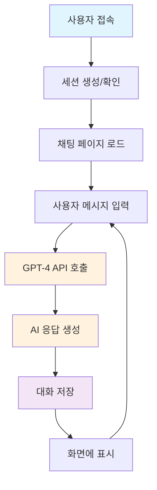
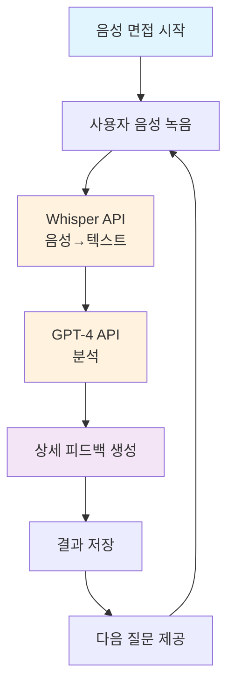
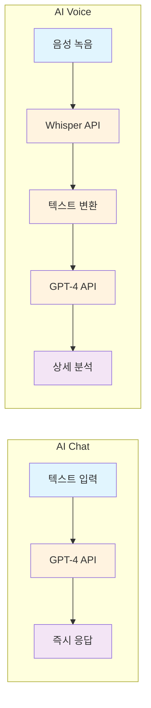
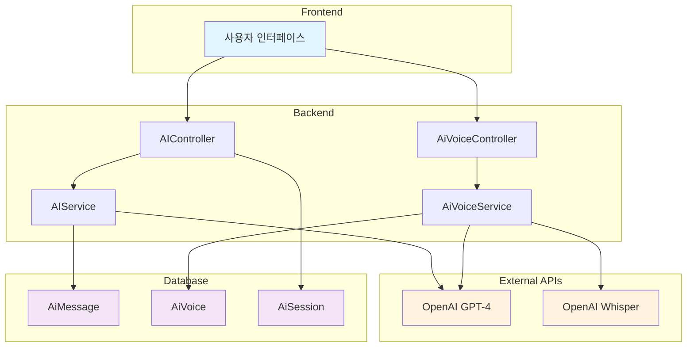
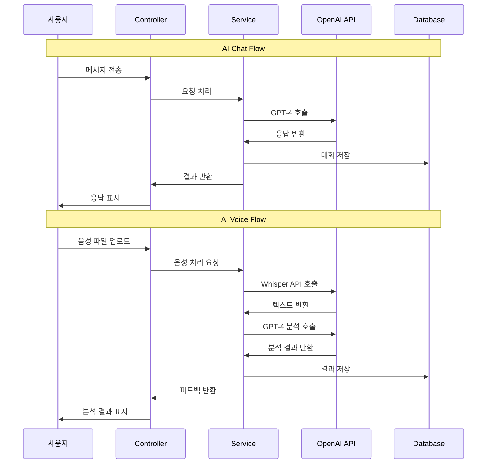
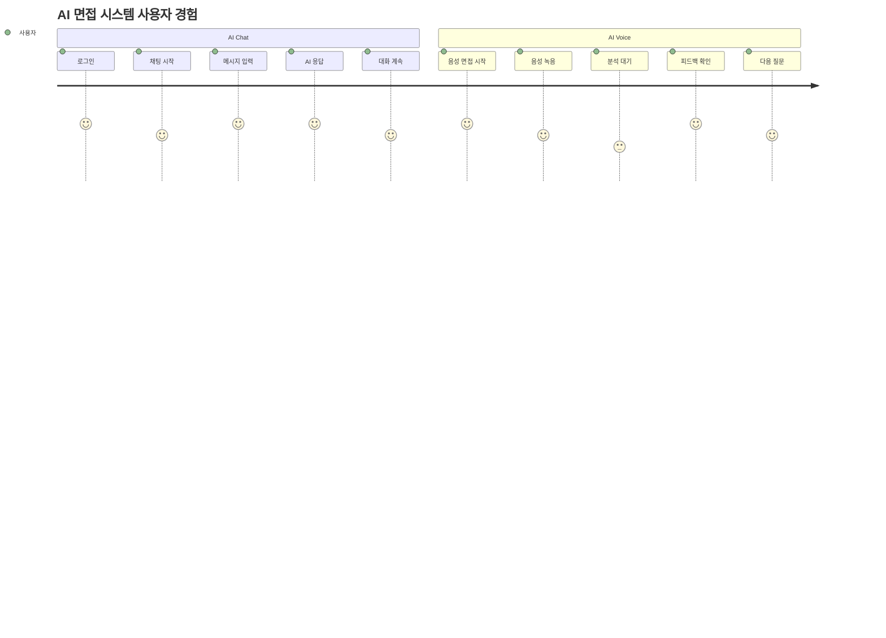

# WAC: Web AI Consulting

**AI 기반 화상 모의면접 플랫폼**

> WebRTC와 AI(GPT, Whisper)를 활용하여 실전처럼 연습하고 정량적인 피드백을 받을 수 있는 화상 면접 연습 플랫폼입니다.

---

##  프로젝트 개요

- **프로젝트명**: WAC (Web AI Consulting)
- **개발기간**: 2025.07.01 ~ 2025.07.28
- **팀명**: 2조
- **주요기능**: 실시간 화상 면접 / AI 기반 음성 및 텍스트 피드백 / 면접 예약 및 결제 시스템 / 마이페이지 / 관리자 페이지

> 비대면 시대에 맞춘 실전형 면접 연습 환경 제공  
> GPT + Whisper + WebRTC 기반의 AI 피드백 및 화상면접 통합 시스템

---

##  기술 스택

### Backend
- Java 17 / Spring Boot 3 / Spring Security / JPA
- MySQL / REST API / WebSocket

### Frontend
- HTML5 / CSS3 / JavaScript / JSP / AJAX / Thymeleaf

### AI & Real-time
- OpenAI GPT / Whisper (음성 인식)
- WebRTC (화상 통신)
- PortOne (결제, 카카오페이)

### DevOps & Infra
- AWS EC2 / RDS(MySQL) / Route53
- GitHub + GitHub Flow
- OS: Windows & macOS (혼용)

---

## 주요 기능 요약

| 기능 구분 | 설명 |
|-----------|------|
| 회원가입/로그인 | 로컬 + 소셜(Kakao) 로그인, 사용자 유형별 권한 분리 |
| 마이페이지 | 예약 내역, 결제, 포인트, 피드백, 회원 정보 수정 |
| 화상면접 | WebRTC 기반 실시간 면접 / 녹화 / 개별 볼륨 조절 / 채팅 |
| AI 면접 | Whisper로 음성 분석 → GPT가 실시간 피드백 |
| 자소서/이력서 | AI 분석 및 문장력·논리성 기반 피드백 |
| 면접 예약 | 면접관과 일정 선택, 중복 차단, 포인트 차감 |
| 결제 시스템 | 카카오페이 결제, 포인트 환전 및 환불 처리 |
| 관리자 페이지 | 회원/예약/결제/환전 관리 및 통계 시각화 |
| 커뮤니티 | 게시판, 리뷰, 댓글 기능 포함 |

---

## 흐름도


## ERD


##  시스템 구조

- WebRTC + Janus: 화상면접
- Whisper → GPT: 음성 텍스트화 후 면접 답변 분석
- Spring Boot MVC: REST API, 인증, DB 연동
- MySQL + JPA: 사용자/예약/결제/포인트 등 관리
- PortOne: 포인트 충전 및 결제 처리
- AWS EC2: 서버 배포, RDS 연동

---

##  팀원 역할 분담

| 이름 | 역할 |
|------|------|
| **조현진** (팀장) | WebRTC/Janus, 채팅, DB설계, EC2 운영, Git 관리 |
| **김예원** | 로그인/회원가입, 마이페이지, 관리자 페이지 |
| **이슬** | 예약/결제, 후기/커뮤니티 게시판, CSS 및 레이아웃 |
| **표정현** | 기획, AI, 자소서/이력서 분석, 면접관 CRUD, 메인 UI/UX|

---

## 설치 및 실행 방법

```bash
# 프로젝트 클론
git clone https://github.com/your-repo-url.git

# IDE (STS4, IntelliJ 등)로 열기
# application.yml에 DB 및 OpenAI API 키 설정

# 빌드 및 실행
./gradlew bootRun

```
---
##  기대효과
- GPT+Whisper를 활용한 정량적 면접 피드백 제공
- WebRTC 기반 실시간 화상면접으로 실전감 향상
- AI 첨삭 기능으로 자소서/이력서 품질 향상
- 면접 복기 및 반복 학습 지원
- 비대면 면접 준비에 최적화된 올인원 플랫폼

##  활용 가능 분야
- 취업 준비생의 자기주도 모의면접 도구
- 대학 진로/취업센터의 AI 피드백 훈련 시스템
- 기업 HR팀 면접관 훈련 시스템
- 언어 훈련, 스피치 교육 등 다양한 확장 활용 가능


## 참고 다이어그램

## AI Chat Flow



### AI Chat 흐름 설명

**🔵 파란색 박스 (시작점)**
- **사용자 접속**: 로그인 후 `/ai/aichat` 페이지 접속
- 세션 ID 파라미터 확인 후 기존 세션 또는 새 세션 생성

**🟠 주황색 박스 (API 처리)**
- **GPT-4 API 호출**: 사용자 메시지를 OpenAI GPT-4로 전송
- **AI 응답 생성**: 면접관 역할의 AI가 적절한 응답 생성

**🟣 보라색 박스 (데이터 처리)**
- **대화 저장**: 사용자 메시지와 AI 응답을 데이터베이스에 저장
- 메시지 6개 이상 시 자동 요약 기능 작동

**🔄 반복 과정**
- 화면에 표시 후 다시 사용자 입력 단계로 돌아가 실시간 대화 지속

---

## AI Voice Flow



### AI Voice 흐름 설명

**파란색 박스 (시작점)**
- **음성 면접 시작**: `/ai/voice/chat` 페이지에서 새 면접 세션 생성
- 미리 정의된 면접 질문 순서에 따라 진행

**주황색 박스 (API 처리)**
- **Whisper API**: 음성 파일을 텍스트로 변환 (Speech-to-Text)
- **GPT-4 API**: 변환된 텍스트를 분석하여 상세 피드백 생성

**보라색 박스 (결과 처리)**
- **상세 피드백 생성**: 발음, 속도, 내용, 장단점, 개선점 분석
- 개선된 답변 예시와 다음 단계 제안 제공

**반복 과정**
- 다음 질문 제공 후 다시 음성 녹음 단계로 돌아가 순차적 면접 진행

---

##  비교 다이어그램



### 📋 비교 설명

**AI Chat 특징:**
- **직접적 처리**: 텍스트 입력 → GPT-4 API → 즉시 응답
- **자유로운 대화**: 사용자가 원하는 주제로 자유롭게 대화
- **실시간성**: 빠른 응답 속도로 자연스러운 대화 가능

**AI Voice 특징:**
- **단계적 처리**: 음성 → 텍스트 → 분석 → 피드백
- **구조화된 면접**: 미리 정의된 질문 순서에 따른 체계적 진행
- **상세 분석**: 발음, 속도, 내용 등 다각도 분석 제공

---

## 시스템 아키텍처



### 시스템 아키텍처 설명

**Frontend (사용자 인터페이스)**
- Thymeleaf 템플릿 기반 웹 인터페이스
- JavaScript를 통한 실시간 상호작용
- WebRTC를 활용한 음성 녹음 기능

**Backend (비즈니스 로직)**
- **AIController**: AI 채팅 관련 HTTP 요청 처리
- **AiVoiceController**: AI 음성 면접 관련 요청 처리
- **AIService**: GPT-4 API 연동 및 채팅 로직
- **AiVoiceService**: Whisper API 연동 및 음성 분석 로직

**External APIs (외부 API)**
- **OpenAI GPT-4**: 텍스트 기반 AI 응답 생성
- **OpenAI Whisper**: 음성 파일을 텍스트로 변환

**Database (데이터 저장)**
- **AiMessage**: 채팅 메시지 저장 (사용자/AI 대화)
- **AiVoice**: 음성 면접 결과 저장 (분석 결과, 피드백)
- **AiSession**: 세션 정보 저장 (대화 세션 관리)

---

## 데이터 흐름



### 데이터 흐름 설명

**AI Chat 데이터 흐름:**
1. **사용자 → Controller**: AJAX를 통한 메시지 전송
2. **Controller → Service**: 비즈니스 로직 처리 요청
3. **Service → OpenAI API**: GPT-4 API 호출
4. **OpenAI API → Service**: AI 응답 반환
5. **Service → Database**: 대화 내용 저장
6. **Service → Controller**: 처리 결과 반환
7. **Controller → 사용자**: JSON 응답으로 화면 업데이트

**AI Voice 데이터 흐름:**
1. **사용자 → Controller**: 음성 파일 업로드
2. **Controller → Service**: 음성 처리 요청
3. **Service → Whisper API**: 음성을 텍스트로 변환
4. **Whisper API → Service**: 변환된 텍스트 반환
5. **Service → GPT-4 API**: 텍스트 분석 요청
6. **GPT-4 API → Service**: 상세 분석 결과 반환
7. **Service → Database**: 분석 결과 저장
8. **Service → Controller**: 피드백 데이터 반환
9. **Controller → 사용자**: 분석 결과 화면 표시

---

## 사용자 경험 흐름



### 사용자 경험 설명

**AI Chat 사용자 경험:**
- **로그인 (5점)**: 간편한 로그인으로 빠른 접근
- **채팅 시작 (4점)**: 직관적인 인터페이스로 쉽게 시작
- **메시지 입력 (5점)**: 텍스트 입력의 편의성
- **AI 응답 (5점)**: 빠르고 적절한 AI 응답
- **대화 계속 (4점)**: 자연스러운 대화 흐름

**AI Voice 사용자 경험:**
- **음성 면접 시작 (5점)**: 체계적인 면접 진행
- **음성 녹음 (4점)**: 간단한 음성 녹음 기능
- **분석 대기 (3점)**: API 처리 시간으로 인한 대기
- **피드백 확인 (5점)**: 상세하고 유용한 피드백
- **다음 질문 (4점)**: 순차적 질문 진행

**전체 평가:**
- AI Chat은 **즉시성과 편의성**에서 우수
- AI Voice는 **체계적 분석과 피드백**에서 우수
- 두 기능 모두 사용자 만족도가 높은 수준

---

## 기술적 구현 포인트

### AI Chat 구현 특징:
- **실시간 처리**: AJAX를 통한 비동기 통신
- **세션 관리**: UUID 기반 세션 생성 및 관리
- **자동 요약**: 메시지 6개 이상 시 GPT-4로 자동 요약
- **히스토리**: 대화 내용의 영속화 및 조회

### AI Voice 구현 특징:
- **음성 처리**: WebRTC를 통한 브라우저 내 음성 녹음
- **API 연동**: Whisper API와 GPT-4 API의 순차적 호출
- **구조화된 분석**: JSON 형태의 상세 피드백 생성
- **순차적 진행**: 미리 정의된 질문 순서에 따른 면접 진행

이러한 다이어그램과 설명을 통해 AI Chat과 AI Voice 기능의 전체적인 구조와 동작 방식을 명확하게 이해할 수 있습니다. 
