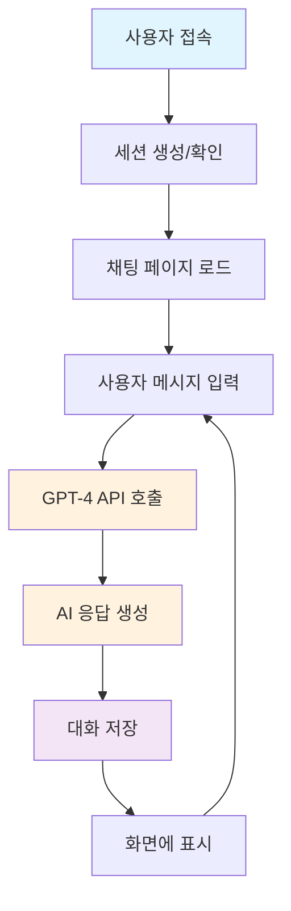
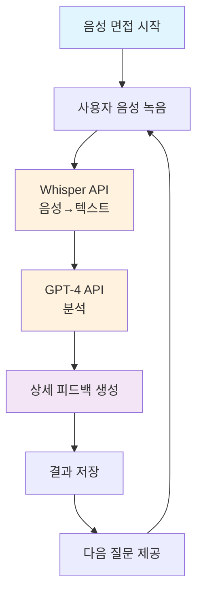
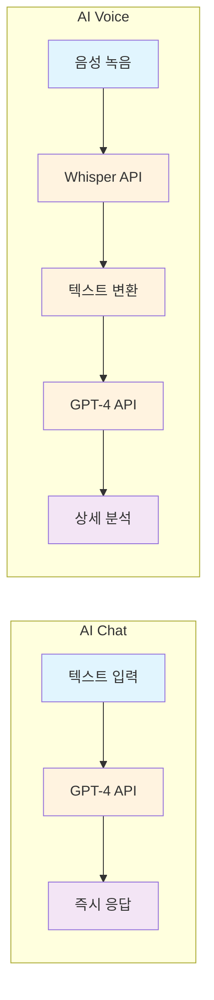
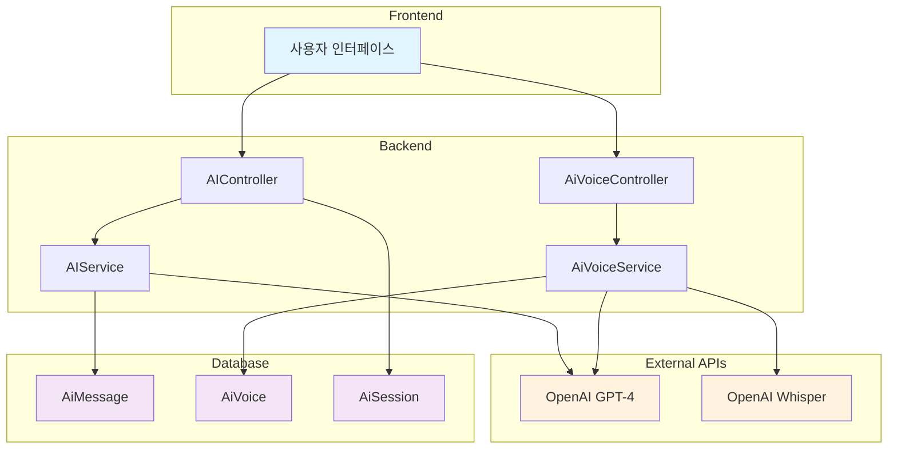
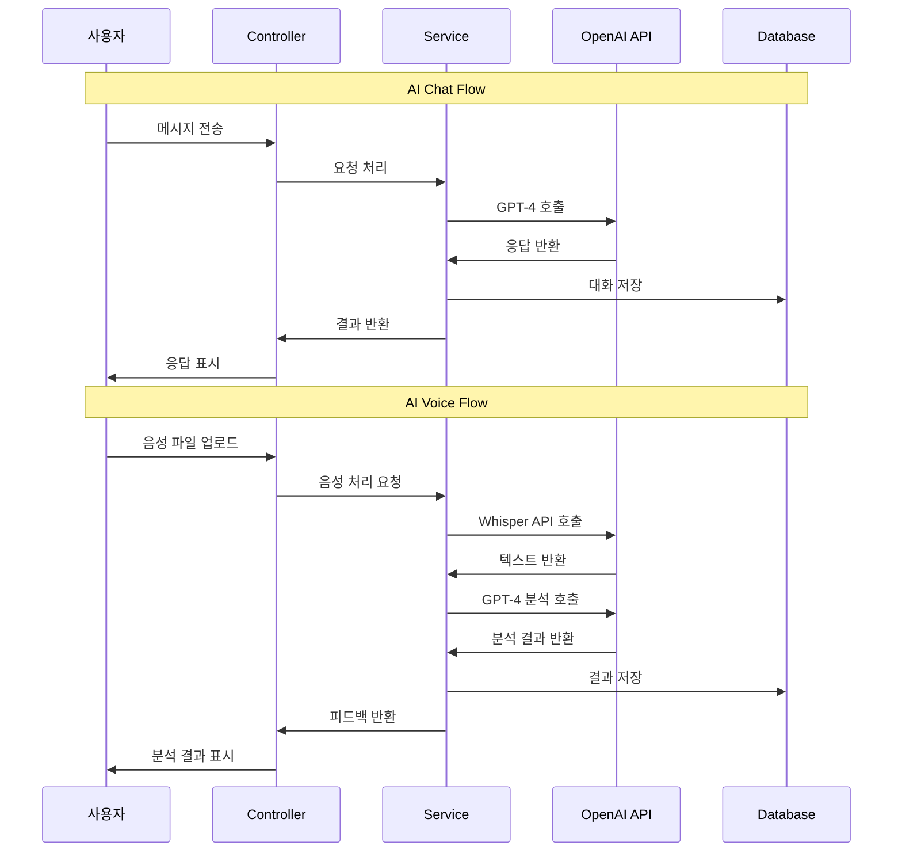
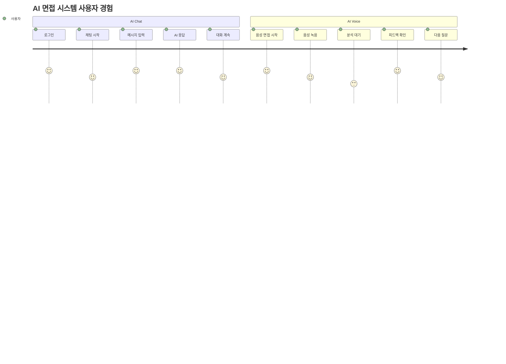

# WAC: Web AI Consulting

**AI 기반 화상 모의면접 플랫폼**

> WebRTC와 AI(GPT, Whisper)를 활용하여 실전처럼 연습하고 정량적인 피드백을 받을 수 있는 화상 면접 연습 플랫폼입니다.

---

##  프로젝트 개요

- **프로젝트명**: WAC (Web AI Consulting)
- **개발기간**: 2025.07.01 ~ 2025.07.28
- **팀명**: 2조
- **주요기능**: 실시간 화상 면접 / AI 기반 음성 및 텍스트 피드백 / 면접 예약 및 결제 시스템 / 마이페이지 / 관리자 페이지

> 비대면 시대에 맞춘 실전형 면접 연습 환경 제공  
> GPT + Whisper + WebRTC 기반의 AI 피드백 및 화상면접 통합 시스템

---

##  기술 스택

### Backend
- Java 17 / Spring Boot 3 / Spring Security / JPA
- MySQL / REST API / WebSocket

### Frontend
- HTML5 / CSS3 / JavaScript / JSP / AJAX / Thymeleaf

### AI & Real-time
- OpenAI GPT / Whisper (음성 인식)
- WebRTC (화상 통신)
- PortOne (결제, 카카오페이)

### DevOps & Infra
- AWS EC2 / RDS(MySQL) / Route53
- GitHub + GitHub Flow
- OS: Windows & macOS (혼용)

---

## 주요 기능 요약

| 기능 구분 | 설명 |
|-----------|------|
| 회원가입/로그인 | 로컬 + 소셜(Kakao) 로그인, 사용자 유형별 권한 분리 |
| 마이페이지 | 예약 내역, 결제, 포인트, 피드백, 회원 정보 수정 |
| 화상면접 | WebRTC 기반 실시간 면접 / 녹화 / 개별 볼륨 조절 / 채팅 |
| AI 면접 | Whisper로 음성 분석 → GPT가 실시간 피드백 |
| 자소서/이력서 | AI 분석 및 문장력·논리성 기반 피드백 |
| 면접 예약 | 면접관과 일정 선택, 중복 차단, 포인트 차감 |
| 결제 시스템 | 카카오페이 결제, 포인트 환전 및 환불 처리 |
| 관리자 페이지 | 회원/예약/결제/환전 관리 및 통계 시각화 |
| 커뮤니티 | 게시판, 리뷰, 댓글 기능 포함 |

---

## 흐름도


## ERD


##  시스템 구조

- WebRTC + Janus: 화상면접
- Whisper → GPT: 음성 텍스트화 후 면접 답변 분석
- Spring Boot MVC: REST API, 인증, DB 연동
- MySQL + JPA: 사용자/예약/결제/포인트 등 관리
- PortOne: 포인트 충전 및 결제 처리
- AWS EC2: 서버 배포, RDS 연동

---

##  팀원 역할 분담

| 이름 | 역할 |
|------|------|
| **조현진** (팀장) | WebRTC/Janus, 채팅, DB설계, EC2 운영, Git 관리 |
| **김예원** | 로그인/회원가입, 마이페이지, 관리자 페이지 |
| **이슬** | 예약/결제, 후기/커뮤니티 게시판, CSS 및 레이아웃 |
| **표정현** | 기획, AI, 자소서/이력서 분석, 면접관 CRUD, 메인 UI/UX|

---

## 설치 및 실행 방법

```bash
# 프로젝트 클론
git clone https://github.com/your-repo-url.git

# IDE (STS4, IntelliJ 등)로 열기
# application.yml에 DB 및 OpenAI API 키 설정

# 빌드 및 실행
./gradlew bootRun

```
---
##  기대효과
- GPT+Whisper를 활용한 정량적 면접 피드백 제공
- WebRTC 기반 실시간 화상면접으로 실전감 향상
- AI 첨삭 기능으로 자소서/이력서 품질 향상
- 면접 복기 및 반복 학습 지원
- 비대면 면접 준비에 최적화된 올인원 플랫폼

##  활용 가능 분야
- 취업 준비생의 자기주도 모의면접 도구
- 대학 진로/취업센터의 AI 피드백 훈련 시스템
- 기업 HR팀 면접관 훈련 시스템
- 언어 훈련, 스피치 교육 등 다양한 확장 활용 가능

##  협업 문서

- [협업 가이드 문서](CONTRIBUTING.md)

##  기타 정보
- 본 프로젝트는 클라우드 데브옵스 자바 풀스택 개발자 과정 (KD) 훈련 과정 중 팀 프로젝트로 수행되었습니다.


# AI Chat & AI Voice 시각적 흐름도

## 🎯 AI Chat Flow



## 🎯 AI Voice Flow



## 🔄 비교 다이어그램



## 🏗️ 시스템 아키텍처



## 📊 데이터 흐름



## 🎨 사용자 경험 흐름



이 다이어그램들은 GitHub, GitLab, Notion 등에서 자동으로 렌더링되어 시각적 흐름도를 보여줍니다. Mermaid 문법을 지원하는 플랫폼에서 바로 이미지로 변환됩니다! 

